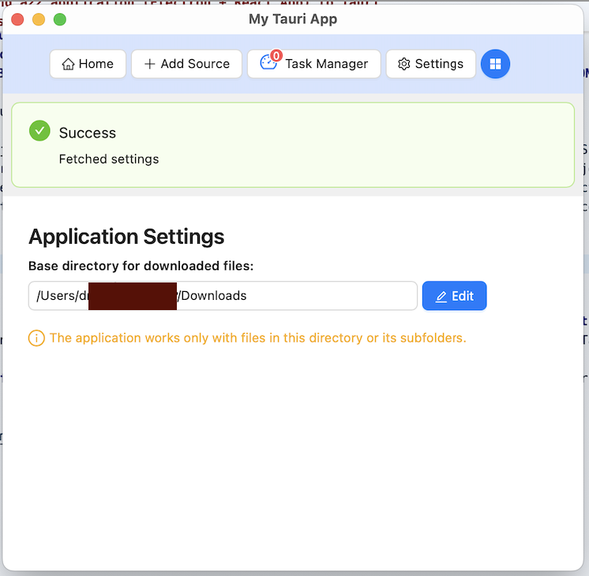

## PoC: Migrating a22 application (Electron + React App) to Tauri/Rust

### Objective

The goal of this PoC was to assess the feasibility and effort required to migrate an existing Electron application with a React UI to a Tauri-based desktop app. The primary aim was to reuse the existing UI **with minimal or no changes**, using **interface adapters** to bridge between the frontend and the new Rust backend.

---

### Key Outcomes
> **Note:** The PoC focused only on a **minimal subset of functionality** — specifically, a single operation to fetch application settings from the store, and a basic task processor with two example tasks.

1. **Quick Build & Launch**     
   Initial setup, build, and launch of the Tauri app were achieved relatively quickly.

2. **Permission Issues in Latest Tauri Versions**  
   Tauri 2.x introduced stricter permission management, specifically with file system access and `listen` permissions.

3. **Permissions Resolved on Tauri 2.0.6**  
   After investigation, the issues were resolved by pinning the project to version `2.0.6`, where permission configurations were more manageable.

4. **Asynchronous Event Timing Differences**  
   Due to true multitasking support in Tauri (Rust), event behavior differed compared to Electron (Node.js). For example, a task could complete and emit results before the UI had received its corresponding task ID.  
   *(Note: This was due to a less-than-ideal design in the original Electron implementation.)*

5. **Strict Typing & Serialization Are Slower in development but potentially Safer**  
   Strong typing and stricter naming/serialization requirements (e.g., `camelCase` vs `snake_case`) increased development complexity and slowed iteration.

6. **Higher Development Overhead Compared to Node.js**  
   While Tauri promises greater runtime stability and performance, the development workflow is more complex, especially for teams less familiar with Rust. This translates to **higher costs** for development and maintenance.

7. **Tauri Advantages**
   - **Mobile Platform Targeting** (iOS/Android) – *Not explored in this PoC*
   - **High Performance** – More relevant for compute-heavy apps
   - **Smaller Bundle Size** – Final build size was ~**80MB**, compared to Electron’s ~**180MB** (over **2x smaller**)

8. **Very slow** build process and sluggish Rust Analyzer

- Building the project using `cargo` takes significantly more time compared to JavaScript/TypeScript toolchains, even for small changes.
- The Rust Analyzer in editors like VS Code performs poorly in larger or async-heavy Tauri projects — with frequent delays in autocomplete, jump-to-definition, and type inference.
- This hampers development speed and makes iteration slower compared to typical Electron + React workflows.
- Workarounds exist (e.g. optimizing `.cargo/config.toml`, reducing crate usage, using workspaces), but they add setup complexity.

---

### Fast Conclusion

While Tauri offers impressive performance and distribution benefits, **the migration from Electron requires non-trivial effort**, especially when dealing with tight integration between frontend and backend logic. The architectural and development constraints imposed by Rust and Tauri’s design should be weighed carefully against the benefits for small- to mid-sized apps.

**Ideal use cases for Tauri**: apps requiring **small binary size**, **native performance**, or **cross-platform (desktop + mobile)** support.

